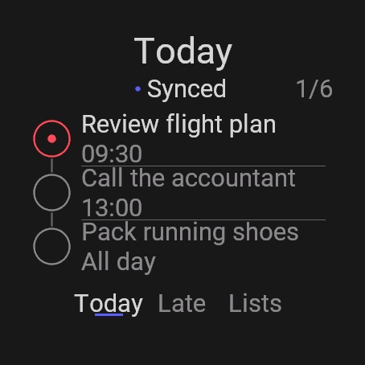

# TickTick Tasks for Garmin

[](https://github.com/Anneo22/ticktick-garmin-app/actions/workflows/checks.yml)

TickTick Tasks for Garmin is an independent Connect IQ watch app for browsing and completing TickTick tasks.

I wanted TickTick on my Garmin without paying another subscription. The result is a small watch app, backed by a narrow OAuth relay, that keeps the common task path usable when the phone connection drops.



## What works

- Pair and unpair through a short code opened on the phone.
- Browse Today, Overdue, projects, and project tasks.
- Navigate with buttons, swipes, or isolated touch targets that cannot complete a task by accident.
- Preserve TickTick's upstream task order across bounded pages.
- Complete tasks with a second confirmation.
- Cache 20 Today tasks and queue up to eight completions while offline.
- Reconcile uncertain completion results without replaying them blindly.

The relay exposes named TickTick operations rather than a general proxy. It encrypts TickTick access tokens at rest and stores watch credentials only as hashes.

## Compatibility

Garmin SDK 9.2.0 compiles the app for 126 watch product IDs across 17 screen families. The signed Store export contains 220 device variants. The tested floor is Connect IQ API 2.4.2 with 98,304 bytes of application memory.

The automated watch suite runs on Fenix 8 47 mm and Instinct 2S. Representative layouts were also checked on Instinct 2, Forerunner 735XT, vivoactive HR, and Venu X1. The exact product set and method are in [the compatibility evidence](docs/compatibility-evidence.md).

## Verify it

The relay requires Node.js 24. The watch build requires Java 17, Garmin Connect IQ SDK 9.2.0, its device packs, and a Garmin developer key.

```sh
npm --prefix relay ci
./scripts/verify-source.sh
```

That validates the watch-relay fixtures, checks that the watch view keeps one copy of its touch geometry, checks the launcher artifacts, runs the public leak check, type-checks the Worker, and runs the relay tests without needing Garmin's SDK.

The launcher mark is generated from one authored geometry. Re-render it after any change to `scripts/render-icon.mjs`:

```sh
node scripts/render-icon.mjs
```

With the Garmin SDK installed and selected in `~/Library/Application Support/Garmin/ConnectIQ/current-sdk.cfg`:

```sh
CIQ_DEVELOPER_KEY=/path/to/developer-key.der ./scripts/verify.sh
```

The full command compiles all 126 SDK product targets and runs 61 Monkey C tests on both Fenix 8 and the 96 KiB Instinct 2S target. Build the signed Store package with:

```sh
CIQ_DEVELOPER_KEY=/path/to/developer-key.der ./scripts/package.sh
```

## Relay

The relay is a Cloudflare Worker with D1 storage and WebCrypto token encryption. It needs these secrets and variables at deployment time:

- `TICKTICK_CLIENT_ID`
- `TICKTICK_CLIENT_SECRET`
- `TICKTICK_REDIRECT_URI`
- `TOKEN_ENCRYPTION_KEY`
- `PAIRING_VERIFICATION_URL`

Do not put production values in `wrangler.toml`, source files, the watch package, fixtures, or logs. See [the OAuth relay decision](docs/adr/0001-oauth-relay.md) and [privacy policy](docs/privacy.md) for the boundary.

## Current status

This is a verified release candidate, not a live Store app. The relay is deployed and its pairing and OAuth redirect boundary pass live checks. Final TickTick consent, exact Today-filter behaviour, physical Fenix 8 acceptance, and Garmin review still need to pass. The first release browses and completes tasks; it does not create, edit, move, delete, or reopen them.

The app has no separate subscription, ads, or analytics. A TickTick account is required, and cloud hosting cannot be promised free forever.

## License

Copyright 2026 Anneo22. Licensed under [Apache-2.0](LICENSE).

TickTick Tasks for Garmin is independent and is not affiliated with TickTick, Garmin, or Cloudflare.
